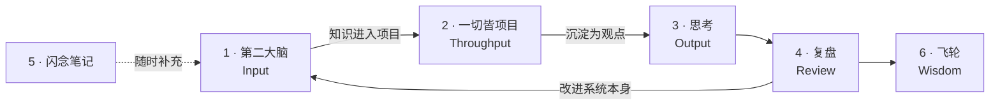
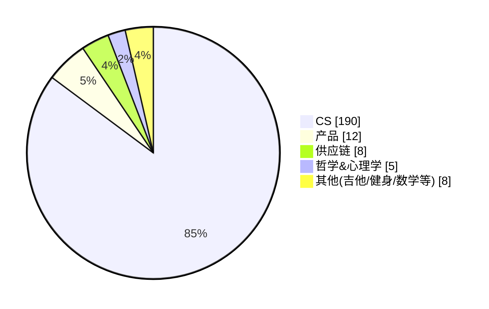

# 第二大脑

> **Notes are not storage, they are cache.**

笔记的价值不在于存了多少,而在于它能否被**重新找到**、与别的知识**建立关系**、进入**真实行动**,并在**复盘**中形成新的判断。

这个仓库公开的是这套系统的**思考过程与结构设计** —— 笔记内容与工具源码不在其中。

---

## 项目概述

| | |
|---|---|
| **性质** | 长期项目,持续复写 |
| **载体** | Obsidian |
| **核心隐喻** | 笔记是缓存,不是仓库 |
| **理论支撑** | DIKW · PARA · PBL · OKR · 信息块理论 |
| **规模** | 6 大区,300+ 篇笔记 |
| **配套工具** | 2 个自建 AI skill |

---

## 一、本质:缓存与命名

> 计算机科学只存在两个难题:**缓存失效**和**命名**。
> — Phil Karlton

知识管理也是如此。这两个难题不是比喻,是同一个问题在不同领域的两次出现。

### 1.1 笔记是缓存

计算机技术最富成效的领域之一,是**弥补人类的弱点**:人算不快,所以让计算机算;人记不住,所以让计算机存。

但关键在于 —— **人不需要记住全部内容,记住"什么在里面"就够了。**

从头到尾读一本手册,意义不在于记住里面的每一条,而在于之后能想起「这件事在那本书里」,并且知道该用什么关键词去搜。**读完留下的是索引,不是全文。**

浏览维基百科时,满屏的蓝色链接就是这个结构的样子:概念之间相互指向,可以随时跳转。整个互联网无非是一张巨大的概念网。

所以第二大脑要做的,是随着自己对世界认识的加深,**构建一张属于自己的缓存网** —— 它不保存世界,它保存通往世界的路径。

这也解释了为什么「存了多少」是个没意义的指标:**缓存的价值在命中率,不在容量。**

### 1.2 命名:为什么要找大词

每一篇笔记对应一个概念,而概念是对世界某个侧面的抽象 —— 这件事的本质,就是**编程里的命名**。

一个具体的经验是:**命名要找大词。**

| 差的命名 | 好的命名 |
|---|---|
| 「前端从 A 子页面跳到 B 子页面,切回来时仍能看到之前的数据」 | 「**状态管理**」 |

后者好在三处:

- **更大范围的共识** —— 别人、AI、以及未来的自己都认这个词
- **更容易组织周围的概念** —— 大词天然是一个聚合点,小词只能挂在某处
- **更低的检索成本** —— 未来复习时,你会用大词去搜,不会用那句长描述

命名找不到大词,通常说明这个概念还没想清楚。**命名的难,本质是理解的难。**

### 1.3 什么是好的笔记系统:看摩擦

> 你经历的摩擦越少,笔记系统就越有效。
> — Jeff Su

摩擦要分四个环节看,任何一环卡住,系统就会被绕过:

| 环节 | 问题 |
|---|---|
| **before** | 你能轻松开始做笔记吗? |
| **during** | 你能多快写下所有内容? |
| **complete** | 你能轻松地共享你的笔记吗? |
| **after** | 你能轻松地重新呈现相关笔记吗? |

多数笔记系统死在 **after** —— 前三步都顺,但存进去的东西再也没被调出来过。那不叫笔记系统,叫垃圾填埋场。

---

## 二、一段怀疑:为什么不直接用大脑

起初我并不看好第二大脑,**怀疑它可视化的美观性远大于实用性。**

这个怀疑是有依据的。从知识图谱的角度看,它最大的卖点是**可解释性** —— 但可解释性本身就是个尴尬的东西。

以生成模型为例:从 GAN 到 VAE 再到 NF,模型的约束越来越强、可解释性越来越好,**但落地最广的却是最不可控的 GAN**。往大了说,整个深度学习都是不可解释的,这并没有妨碍它被广泛使用。**当一个黑箱确实好用的时候,没人关心它内部的原理。**

学习也一样。学 Java 时,拿搜索引擎和知识图谱去分析各个技术点之间的关系,远不如直接找一门课程、对着 JD 学来得高效 —— 那个课程的设计者,**本身就像一个不可解释的深度学习模型**:凭市场嗅觉给出一份大纲,而它确实有效。

那么问题来了:

> **我们的大脑本身就是一个超级版本的、不可解释的知识图谱,而且已经被证明非常 work。**
> 那我们为什么还要费尽心思在体外再构建一个?

这个问题必须先回答,否则整套系统就只是好看。

---

## 三、体外构建的三个理由

### 3.1 为什么需要概念库

语言学有一个观察:**如果大脑对一件事没有概念,它就倾向于不去想那件事**;如果一个民族的语言里缺少某个概念,这个民族就倾向于从未思考过它。

李笑来判断一个人是否聪明的标准,是**他脑子里有多少清晰准确的概念**。

回看自己精进一个领域的过程,本质上就是对该领域内重要概念**不断接触 → 理解 → 领悟**的过程。不管是精通一门知识还是掌握一项技能,fundamentals 都至关重要 —— 而 fundamentals 对应的,正是知识图谱上一个个具体的 concept。

**概念库要收集的不是资料,是定义。** 借此厘清:我脑子里到底有哪些概念是清晰的。

### 3.2 为什么需要双链

一句话:**原子化,唯一更新处。**

这和软件工程里对**高内聚、低耦合**的追求是同一件事。概念库一旦建起来,立刻会遇到重复的问题 —— 同一个概念在十篇笔记里被反复定义,更新时改不全,于是版本互相矛盾。

代码里的解法是 `import`:定义只写一次,别处引用。双向链接就是笔记里的 `import`,**它给了每个概念一个唯一的更新处**。

解耦之后,省下的不只是打字 —— 而是可以**专心在一处**把对某个概念的最新认知更新好,而不必担心别处还有旧版本在流传。

> 就比如这篇文档,前后改了十多次,大部分是新认知的迭代 —— 这在过去的记录方式里几乎不可想象。

### 3.3 为什么需要记录下来

**理由一:对单个概念,避免注意力资源的重复投入。**

有些当时总结出的宝贵经验,如果没有留存,过一段时间要重新达到当时的认知水平,得再投入一次同等的精力。一份由自己切身总结、组织良好的知识库,消除的正是这种重复投入。

如果把专注力视为脑力工作者最稀缺的资源,那就不该坐视阶段性成果流失。**知识和资产一样会产生复利** —— 每一分投入都让下一次的起点更高。

**理由二:对整个网络,它标记出了边缘。**

工作或学习中常见的困境是:核心概念已经掌握得不错,但**边缘概念拓展不出去**。原因之一是,生物大脑触达边缘本身就很费力 —— 你想不起来自己不知道什么。

第二大脑在整体上构建出概念网络之后,相当于**把"当前认知能触达的边界"存了下来**。下一次拓展时,从边缘出发,而不是从中心重新走一遍。

> 这也是配套工具 `knowledge-gap` 存在的理由 —— 见第七节。

### 关于混乱

> I try to embrace messiness because my brain is also messy.

不必追求一个完美整洁的结构。同一份数据,不同的数据结构会导致排序的时间复杂度不同 —— **知识可能也是如此,有效的组织带来效率提升**,但"有效"不等于"整齐"。

---

## 四、底层逻辑

前三节讲的是**为什么**。具体怎么做,由五个理论各管一件事:

| 理论 | 管什么 | 回答的问题 |
|---|---|---|
| **DIKW** | 分层 | 这条信息处在哪一级?怎么升级? |
| **PARA** | 组织 | 它该放进哪个区? |
| **信息块理论** | 粒度 | 一篇笔记应该多大? |
| **PBL** | 内化 | 知识凭什么变成能力? |
| **OKR** | 校准 | 该记什么、不该记什么? |

### DIKW:分层


每一级之间的动作不同:D→I 靠筛选,I→K 靠内化,K→W 靠实践。所谓「无效学习」,本质都是**卡在低层级上不去** —— 收藏一篇好文只完成了 D。

整体是一条 **信息 → 知识 → 习惯与智慧** 的路径。

### PARA:按可执行性分,而不是按学科分

传统分类问「这属于什么领域」,PARA 问「**这东西现在有多活跃、离行动有多近**」。

按学科分,一个文件夹里会同时躺着上周要交的作业和三年前存的教程,打开还得再筛一遍;按可执行性分,当下要动的永远在最上层 —— **找东西的成本被前置到了归档的那一刻。**

### 信息块理论:给笔记定粒度

一条经验数据:人每分钟约能记住一个「信息块」,一门学科约含 5 万个块 —— 掌握一门学科的量级约为 1000 小时。

这个数字的用处不是励志,而是**定粒度**:一篇笔记应当只承载一个信息块;粒度统一之后,概念才能被双链复用,而不是被抄写多次。

### PBL:K → W 唯一的一跃

DIKW 里 K→W 是**没法靠"读"完成的**。项目之所以能完成这一跃,靠的是它的**不确定性** —— 没有试错空间,就只是执行,不产生认知。

所以「一切皆项目」在本系统里是一个**独立的大区**,而不是笔记的附属品。

### OKR:反向约束输入

没有目标,「有用」就没有标尺,结果是什么都觉得有用,于是什么都记。

---

## 五、系统结构

六个区对应信息的完整生命周期,**是一条单向流转的链路**:



注意第 4 区那条**回指 Input 的箭头** —— 复盘的产物不只是感想,还包括对这套结构本身的修改。

### 知识分布



高度集中在 CS,产品次之,其余是长尾兴趣。**这张图的用途是看缺口** —— 哪个领域的块还缺得多,一眼可见,这也正是 `knowledge-gap` 工具自动化的那件事。

### 关系图谱


*全局视图。几个明显的高连接度节点是 MOC(Map of Content)索引页,它们不承载内容,只负责把一个领域的笔记聚起来。散落的孤立点是尚未接入网络的新笔记 —— 它们的存在本身就是待办事项。*


*聚焦一个 MOC 节点(Agent 工程总览)后的样子:一个索引页向下辐射二十余篇具体笔记。这是原子化原则的实际形态 —— 概念被拆成小块分别存放,再由索引页组织,而不是写成一篇巨大的长文。*

---

## 六、操作约定

理念要落到可执行的规则上,否则维护不下去。

### 6.1 命名

一篇 markdown 对应一个概念、文章或方案,并用后缀区分类型:

| 后缀 | 含义 | 例 |
|---|---|---|
| (无) | 概念 | `状态管理` |
| `$` | 行动计划与执行方案 | `托福考到 100$` |
| `@` | 带目录性质的索引(MOC) | `Java@` |

除 `$` 类之外,**标题一律尽可能用大词、术语** —— 降低和 AI 交流、和他人交流、以及未来自己回溯搜索时的成本。

### 6.2 什么时候才拆成原子笔记

不是所有概念都值得独立成篇。判据是**被引用次数**:

> 当一个概念的 usage 次数足够多时,才拆成独立的 concept —— 被引高,抽出来的收益才大。
> 反之就内联在原处,**像 Java 里的内部类一样**。

过早拆分的代价是碎片化:一堆只被引用过一次的小文件,反而增加了检索负担。

### 6.3 常青笔记

**篇内:** 围绕一个概念持续更新最新认知,保持缓存的实时性。用 `---` 分割出 **Unstaged 区域** —— 尚未整理进正文的新想法先落在那里,不阻塞记录。

**篇外:** 随项目进度不断移动、调整 file tree,一般路径是 `最近项目 → 第二大脑 / 博客` 方向沉淀。

> Just do it. The most valuable notes I have today would never come to be if I needed to think about a folder or category for it.

**记录优先于归类** —— 归类可以事后做,想法过去了就没了。

### 6.4 最佳实践显式标记

总结出的最佳实践用 callout 语法高亮出来,和普通内容区分开 —— 复习时先看这些。

---

## 七、迭代机制

「持续复写」不是态度,得有机制托着,否则系统建成那天就是它停止生长的那天。

### 7.1 复盘 —— 让问题被定期发现

复盘是独立大区,产出有两种:对**事**的复盘(项目哪里判断错了),和对**系统**的复盘(这套结构哪里不好用)。第二种对应五、里那条从 Review 回指 Input 的箭头。

### 7.2 版本控制 —— 让复写变得安全

整个 vault 纳入 **git 管理**。这在笔记场景里不常见,但它改变的东西很本质:

| 没有版本控制 | 有版本控制 |
|---|---|
| 改旧笔记 = 覆盖,原来的想法消失了 | 改动可回溯,旧版本仍在 |
| 于是倾向「新开一篇」 | 于是敢于直接重写 |
| 结果:同一主题越堆越多 | 结果:一个主题始终只有一篇当前版本 |

**「不敢改」才是笔记库膨胀的真正原因。** 版本控制把这个顾虑消掉之后,复写才真的可行 —— 这也正是 6.2「唯一更新处」得以成立的前提。

### 7.3 复写 —— 笔记不是写完就冻结

第一版几乎必然是摘抄和转述,停在 DIKW 的 I 层。

真正推动它到 K 的,是**过一段时间之后有了新的感悟** —— 在别处读到相关的东西、在项目里踩到了坑、或者换个角度看懂了。这时候回来重写,**写不出来的地方就是当初没真懂的地方**。

所以复写的触发点**不是日程,是新认知**。没有新东西不必动它,有了就该动。

---

## 八、配套工具

结构越大,人自己越难看清它的全貌。所以写了两个 AI skill,让助手读懂这套系统之后再给建议。

> 以下只介绍设计思路与能力,不公开源码。

### `obsidian-vault-advisor`

**做什么:** 基于笔记内容回答问题、给建议,而不是基于模型的通用知识。

**设计上最关键的是「先轻后重」:**

```
浏览目录结构  →  关键词轻检索(打分排序)  →  判断值不值得读  →  只读高相关的
```

为什么不直接全读:几百篇全喂进去既烧 token 又会**稀释重点** —— 模型在一堆半相关内容里反而抓不住关键。所以设了**读取预算**(首轮至多 12 篇,复杂问题至多 20 篇),超预算必须先说明理由。

**另外两条硬约束:**

- 回答必须区分「笔记里明确写了的」/「我推断的」/「证据不足的」—— 防止把推测说成事实
- **默认只读不写**;移动或重命名前先查反向链接,不能把双链改断

### `knowledge-gap`

**做什么:** 检索某个领域的全部笔记,分析这块知识的**完整度**,指出薄弱点与空白。

这直接对应信息块理论 —— 既然一门学科可以被估算成有限个块,就可以反过来问:**这个领域我已经有哪些块、还缺哪些块?**

比人工回看的优势在于:**人只会注意到自己想得起来的东西**,而空白恰恰是想不起来的那部分。这也正是 3.3「标记边缘」的自动化。

---

## 使用条款

本仓库公开的是**系统框架与设计思路**,笔记内容与工具源码不在其中,保留所有权利。

文中引用的观点已标注来源;其余分析与操作约定为本人总结。
