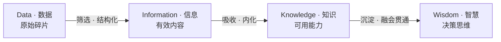
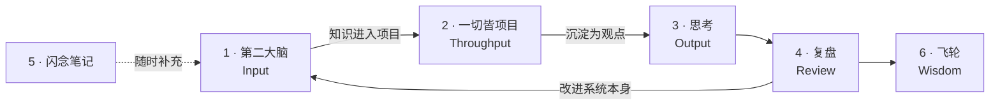
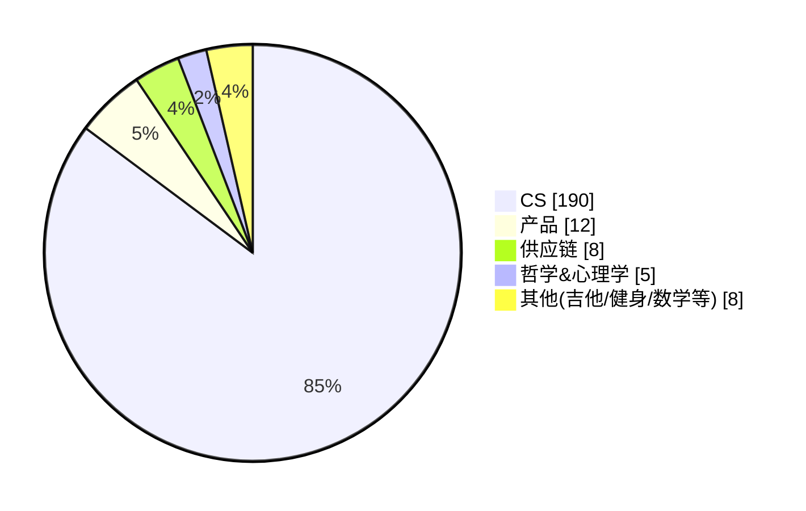
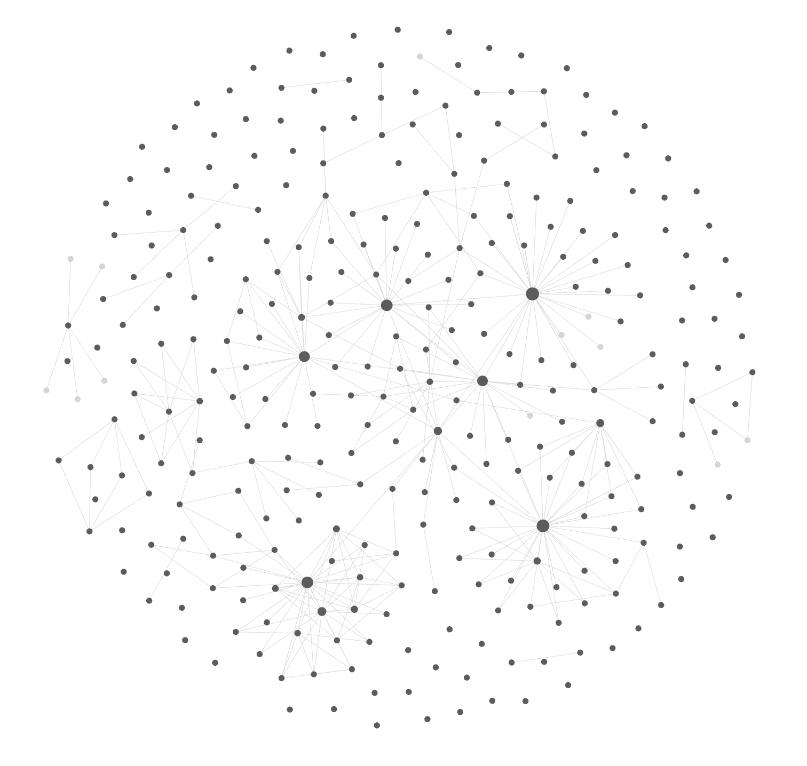
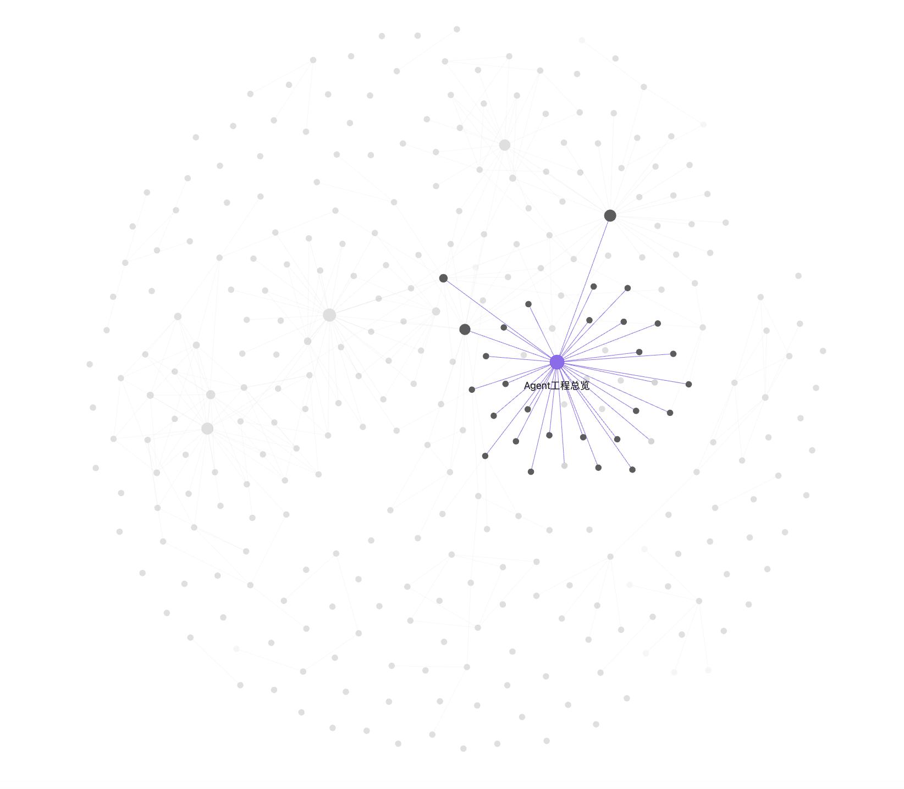

# 第二大脑

> **一套持续迭代的个人知识系统**

这是一个**长期项目,仍在演进中** —— 结构、方法与配套工具都还在改。本文记录的是它当前的样子,以及每一处这样设计的原因。

公开的是**框架与设计思路**,笔记内容与工具源码不在其中。

---

## 项目概述

| | |
|---|---|
| **状态** | 长期进行中,持续迭代 |
| **载体** | Obsidian |
| **理论基础** | DIKW · PARA · PBL · OKR · 信息块理论 |
| **规模** | 6 大区,300+ 篇笔记 |
| **配套工具** | 2 个自建 AI skill —— 让助手读懂这套结构后再给建议 |

---

## 一、问题

三个现实问题,依次推出这套系统的三个基本要求。

### 1.1 信息与知识爆炸 —— 所以需要存储

可获取的信息是无限的,一天能读的东西是有限的,而且差额还在拉大。

应对方式不止一种 —— 也可以收窄摄入面、只跟少数高质量来源,或者干脆接受错过、专注在手头的事情上。这些路子各有各的道理。

**这个项目选的是外部存储这条:** 把当下学到的东西存下来,用以对抗遗忘曲线 —— 不指望记住全部,只要求需要的时候能找回来。同时保留后续**扩展和修改**的余地:存进去的不是终稿,而是可以继续迭代优化完善的信息。

> **要求一:得有一个能存、能找回来的地方。**

### 1.2 存下来 ≠ 学会了 —— 所以需要方法论

存储解决的是「不丢」,不解决「变成自己的」。

一份存下来但从没被调用过的资料,和没存过没有区别。**信息要变成能力,中间还隔着一层内化**,而内化不会自动发生 —— 收藏一篇好文的那一刻,大脑会产生一种"已经学到了"的错觉,这种错觉本身就是最大的阻碍。

**vibe coding 让这件事变得更突出。**

AI 能写代码之后,产出速度和认知增长开始脱钩:一个项目做完了、东西能跑,但过程里很多决策是模型做的 —— 为什么这么设计、当时排除了什么方案、边界在哪,这些没有在自己脑子里留下痕迹。

| 表面 | 实际 |
|---|---|
| 项目做完了 | 说不清关键决策为什么这么定 |
| 代码能跑 | 换个场景不知道该改哪 |
| 交付物在增加 | 能力不一定同步增长 |

这不是说 vibe coding 学不到东西 —— 它其实见识面更广、迭代更快,能接触到自己原本写不出来的方案。**但获得的东西从「亲手推导过」变成了「见过、用过」**,这两种认知的牢固程度不一样,后者更容易在换个场景时失效。

**做完与学会之间的关联被削弱了**,而落差有多大,取决于有没有把过程里的判断留下来。

那么「内化」具体该怎么发生?这需要一套判据 —— 信息处在哪一级、什么时候算升级、凭什么变成能力。**这部分由 DIKW、PBL 等理论回答,见[二、理论基础](#二理论基础)。**

> **要求二:光有存储不够,还得有一套定义内化过程的方法论。**

### 1.3 知识半衰期在变短 —— 所以需要能改的知识库

尤其在 AI 相关领域,今年的最佳实践明年可能就作废了 —— 模型换代、API 改版、范式迁移,一年一轮。这让传统的「归档」思路直接失效:

> **档案的价值在于不变,而这类知识的价值恰恰在于跟得上变化。**

于是笔记不能是写完就封存的档案,它必须**可以被推翻、被重写**。存储层不能只支持**写入**,还必须支持**修改** —— 只能往里加、不能往回改的系统,存得越多,过期的内容占比就越高。

而"能改"还不只是编辑器层面的事。真正让人不敢改的是**怕丢**:改掉旧笔记,当时的想法就没了,于是宁可新开一篇。所以这个要求实际上是两条 —— **改得动**,而且**改了能回退**。

综合这三条要求,最后选择了 **Obsidian** 作为载体,理由见[二、理论基础](#为什么是-obsidian)。

> **要求三:知识库本身要能被修改、被迭代,且修改是安全的。**

### 1.4 机制的必要性

三条要求指向同一件事:**规则必须事先定义好**。

习惯会松、记性会忘、心情会变 —— 靠自觉维持的系统迟早会停。而没有事先定义的规则时,笔记库会稳定地退化成一个只进不出的仓库:

| 没定义的问题 | 后果 |
|---|---|
| 这条信息该放哪 | 分类靠临时判断,同类东西散在三个地方 |
| 什么时候算「学会了」 | 收藏等于学会,囤积产生虚假的踏实感 |
| 知识凭什么变成能力 | 读了很多,真做的时候还是不会 |
| 该记什么、不该记什么 | 什么都记,于是什么都找不到 |
| 旧笔记过时了怎么办 | 不敢删也不想改,于是新开一篇,同主题越堆越多 |

所以要定义的不是「怎么记」,而是**信息在系统里怎么流动**:每一层的入口判据、出口判据,以及升级到下一层的条件。

后面三节就是这套定义 —— 判据(二、)、结构(三、)、以及让它能自我修正的机制(四、)。

---

## 二、理论基础

这五个理论都不是自创的,是现成的通用模型。放在一起用,是因为**它们各自只解决一个问题,单独任何一个都撑不起一套系统**:

| 理论 | 管什么 | 回答的问题 |
|---|---|---|
| **DIKW** | 分层 | 这条信息处在哪一级?怎么升级? |
| **PARA** | 组织 | 它该放进哪个区? |
| **信息块理论** | 粒度 | 一篇笔记应该多大? |
| **PBL** | 内化 | 知识凭什么变成能力? |
| **OKR** | 校准 | 该记什么、不该记什么? |

以下每一节都是**先说这个理论是什么,再说在这套系统里怎么用**。

### DIKW:分层

**是什么 ——** 一个认知递进模型,把人对世界的把握分成四级:**数据 → 信息 → 知识 → 智慧**。原始素材经过处理成为有效信息,信息经过内化成为可用的知识,知识经过长期实践沉淀为决策判断。



**这里怎么用 ——** 它是整套系统的**主轴**,六大区的排列顺序就是这四级的实现(见三、)。

用它最实际的作用是**给"学到了"下判据**。每一级之间的动作是不同的:D→I 靠筛选,I→K 靠内化,K→W 靠实践。于是「无效学习」有了准确的描述 —— **卡在低层级上不去**:收藏一篇好文只完成了 D,读完并结构化才到 I。这解释了为什么收藏夹里躺着一百篇好文却不产生任何能力。

### PARA:组织

**是什么 ——** Tiago Forte 提出的信息分类法,把所有材料分成四类:

| 层 | 定义 |
|---|---|
| **P** Projects | 有周期、有目标、正在推进 |
| **A** Areas | 长期负责、无截止时间 |
| **R** Resources | 将来可能用到的参考 |
| **A** Archives | 已完成或已失效,冻结但不删 |

它最反直觉的一点是:**不按学科分,按可执行性分**。传统分类问「这属于什么领域」,PARA 问「这东西现在有多活跃、离行动有多近」。

**这里怎么用 ——** 六大区的划分依据就是它。最直接的体现是「一切皆项目」**独立成为一个大区**(P 层),而不是挂在某个学科目录下面;知识区则整体承担 R 的角色。

好处在检索成本:按学科分,一个文件夹里会同时躺着上周要交的作业和三年前存的教程,打开还得再筛一遍;按可执行性分,当下要动的永远在最上层 —— **找东西的成本被前置到了归档的那一刻。**

### 信息块理论:粒度

**是什么 ——** 来自实验心理学的一个估算:人每分钟大约能记住一个「信息块」(chunk),而一门学科约含 5 万个块 —— 也就是说,掌握一门学科的量级大约是 1000 小时。

**这里怎么用 ——** 这个数字的用处不是励志,是**给笔记定粒度**:一篇笔记应当只承载一个信息块,大到需要拆开才能理解的就该拆。

粒度统一带来的直接收益是**可复用**:一个概念在多处被引用,而不是被抄写多次 —— 这也是双链能真正发挥作用的前提。

它还顺带给出一个可估算的问题:**某个领域还缺多少块**。三、的知识分布饼图和五、的 `knowledge-gap` 工具,回答的都是这件事。

### PBL:内化

**是什么 ——** 项目式学习(Project Based Learning):以真实项目为载体、以解决具体问题为核心的学习方式,区别于被动地看书听课。它的有效性依赖项目本身的几个特征 —— 目标唯一、周期有限、必须产出结果,以及最关键的**存在不确定性**。

**这里怎么用 ——** 它负责 DIKW 里 K→W 这一跃,而这一跃**没法靠"读"完成**。项目之所以能完成它,靠的正是那个不确定性 —— 没有试错空间,就只是执行,不产生认知。

这也正是 1.2 里 vibe coding 那个问题的解法:**项目必须留下自己的判断**,否则做完了也只是"见过"。

所以「一切皆项目」是独立大区,而不是笔记的附属品。**知识不进项目,就永远停在 K。**

### OKR:校准

**是什么 ——** 目标管理方法:先定义 Objective(要达成什么),再定义 Key Results(用什么可衡量的结果证明达成了)。

**这里怎么用 ——** 前面四个理论解决「怎么处理已经进来的信息」,OKR 解决更前面的问题:**什么信息该被放进来**。

目标反向约束输入。没有目标,「有用」就没有标尺 —— 结果是什么都觉得有用,于是什么都记,回到 1.4 那张表里的老问题。

### 为什么是 Obsidian

工具的选择不是偏好问题 —— **一、里那三条要求,直接排除了大部分候选**。

| 要求 | Obsidian 怎么满足 |
|---|---|
| **存得下、找得回** | 全文检索 + 双向链接,概念之间可互指,形成网络而非树状目录 |
| **支持内化的结构** | 双链让同一概念只有一个更新处;图谱视图让结构本身可见 |
| **改得动、改了能回退** | **笔记就是本地纯文本 markdown 文件** —— 于是可以直接用 git 管版本 |

最关键的是最后一条:**因为是本地纯文本,而不是某个云服务里的数据库记录**,才有了后面两件事 ——

- **四、版本控制**:git 直接管理 markdown
- **五、AI skill 可以直接读**:脚本能遍历目录、能 grep、能读文件,不需要任何 API

换句话说,选 Obsidian 不只是选了个编辑器,**是选了一种"数据归自己所有、且对程序可读"的存储形态**。后面两节能做成的事,前提都在这里。

---

## 三、结构:六大区与信息流转

六个区对应信息的完整生命周期,**是一条单向流转的链路**,不是六个并列的文件夹:



| 区 | 职能 | 对应 |
|---|---|---|
| **1 · 第二大脑(Input)** | 系统工具 / 知识 / 工作流与方法论 | DIKW 的 D、I、K |
| **2 · 一切皆项目(Throughput)** | 知识在这里被真正使用 | PBL |
| **3 · 思考(Output)** | 项目产出的观点与结论 | K → W |
| **4 · 复盘(Review)** | 定期回看,**并回过头改系统本身** | 迭代机制(四、) |
| **5 · 闪念笔记** | 灵光一现的入口,不强制归类 | 降低记录门槛 |
| **6 · 飞轮** | 信息 / 认知 / 项目 / 能力 / 影响力 / 投资六个子系统 | W |

**整个设计里最要紧的是第 4 区那条回指 Input 的箭头。** 复盘的产物不只是感想,还包括对这套结构本身的修改 —— 系统必须能改自己,否则建成之日就是它停止生长之时。

### 知识分布



高度集中在 CS,产品次之,其余是长尾兴趣。

**这张图的用途是看缺口,不是看成绩** —— 哪个领域还薄、薄在哪,一眼可见。把这件事自动化,就是第五节里 `knowledge-gap` 这个工具存在的理由。

### 关系图谱



*全局视图。几个明显的高连接度节点是 MOC(Map of Content)索引页 —— 它们不承载内容,只负责把一个领域的笔记聚起来。散落的孤立点是尚未接入网络的新笔记,**它们的存在本身就是待办事项**。*



*聚焦一个 MOC 节点(Agent 工程总览)后的样子:一个索引页向下辐射二十余篇具体笔记。概念被拆成小块分别存放、再由索引页组织,而不是写成一篇巨大的长文。*

---

## 四、迭代机制

「持续迭代」不是一句态度,得有机制托着。这套系统里有三个,**分工明确,缺一条就会停**。

### 4.1 复盘 —— 让问题被发现

复盘是独立大区,产出有两种:

- 对**事**的复盘 —— 项目做完了,哪里判断错了
- 对**系统**的复盘 —— 这套结构本身哪里不好用

第二种是关键,对应三、里那条从 Review 回指 Input 的箭头。

### 4.2 版本控制 —— 让修改变得安全

整个 vault 纳入 **git 管理** —— 这正是二、里选择 Obsidian 换来的能力。它改变的东西很本质:

| 没有版本控制 | 有版本控制 |
|---|---|
| 改旧笔记 = 覆盖,原来的想法消失了 | 改动可回溯,旧版本仍在 |
| 于是倾向「新开一篇」 | 于是敢于直接重写 |
| 结果:同一主题越堆越多 | 结果:一个主题始终只有一篇当前版本 |

**「不敢改」才是笔记库膨胀的真正原因** —— 怕丢掉过去的想法,就只好不断新建。把这个顾虑消掉,复写才真的可行。

### 4.3 复写 —— 笔记不是写完就冻结

一篇笔记的第一版几乎必然是摘抄和转述,那还停在 DIKW 的 I 层。

真正推动它到 K 的,是**过一段时间之后有了新的感悟** —— 在别处读到相关的东西、在项目里踩到了坑、或者换个角度看懂了。这时候回来重写,**写不出来的地方,就是当初没真懂的地方**。

所以复写的触发点**不是日程,是新认知**。没有新东西不必动它,有了就该动。

---

## 五、配套工具

结构越大,人自己越难看清它的全貌。所以写了两个 AI skill,让助手读懂这套系统之后再给建议。

两个 skill 都装在自建的 **[Pi Desktop](https://github.com/tangyutong2017-dot/pi-desktop)** 里运行 —— 那是另一个项目:把终端里的 AI 编程助手做成 macOS 应用,并给它加了一层可登记、可开关的能力层。skill 在它的 Skills 页里按文件夹分类管理,可以单个或整组启停,**关掉的 skill 对模型完全不可见**。

> 以下介绍设计思路与关键取舍,不公开源码。

### `obsidian-vault-advisor`

**目标:** 基于笔记内容回答问题、给建议,而不是基于模型的通用知识。

**核心设计是「先轻后重」的检索链路:**

```
浏览目录结构  →  关键词轻检索(脚本打分排序)  →  判断值不值得读  →  只读高相关的
```

轻检索用一个打分脚本完成:按文件名、标题、正文命中数和命中关键词数量给候选笔记排序,并展示少量命中行,**让模型先看见"哪些可能相关"再决定读什么**。

**为什么不直接全读:**

几百篇全喂进上下文,既烧 token,更严重的是**稀释重点** —— 模型在一堆半相关内容里反而抓不住关键。所以设了**读取预算**:首轮至多 12 篇,复杂问题至多 20 篇,超预算必须先说明理由再继续。

**另外两条硬约束:**

| 约束 | 解决什么 |
|---|---|
| 回答必须区分「笔记明确写了的」/「推断的」/「证据不足的」 | 防止 AI 把推测说成事实 —— 基于私人笔记给建议时,这类错误最难被发现 |
| **默认只读不写**;移动或重命名前先查反向链接 | 双链一旦改断,网络结构就坏了,而且不容易察觉 |

### `knowledge-gap`

**目标:** 检索某个领域的全部笔记,分析这块知识的**完整度**,指出薄弱点与空白。

它直接对应信息块理论 —— 既然一门学科可以被估算成有限个块,就可以反过来问:**这个领域我已经有哪些块、还缺哪些块?**

**比人工回看强在哪:**

> 人只会注意到自己想得起来的东西,而空白恰恰是想不起来的那部分。

这也是知识分布饼图想说的事的自动化版本:饼图告诉你**哪个领域薄**,这个工具告诉你**薄在哪几块**。

---

## 参考与延伸

这套系统的搭建过程中参考了不少现成的方法论,主要来源:

- **PARA** —— Tiago Forte
- **DIKW / PBL / OKR / 信息块理论** —— 通用模型
- [**转了码刘公子**](https://liu-gong-zi.com) —— 整套「第二大脑 + 飞轮」框架的最初启发来源;关于笔记本质与概念组织的[进一步讨论](https://fq6a0001xu.feishu.cn/wiki/AOpEwru1RisVZekiuj0cfPEynlh)

本文中的结构设计、迭代机制与两个配套工具为本人实现。

---

## 使用条款

本仓库公开的是系统框架与设计思路,笔记内容与工具源码不在其中,保留所有权利。
