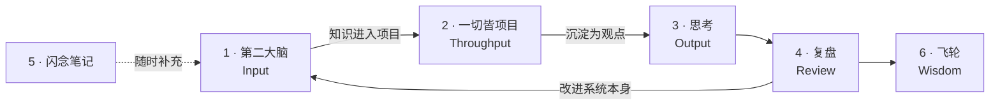

# 第二大脑

> **一套持续复写的个人知识系统**

不是「我怎么用 Obsidian 记笔记」,而是一套**有理论依据的信息处理系统** —— 信息进来之后往哪走、什么时候升级成知识、什么时候必须变成行动,全部事先定义好。

目前 303 篇笔记在这套结构里流转。**结构本身也在被不断复写** —— 它不是一次想好的,是用出问题、再改回来的。

---

## 项目概述

| | |
|---|---|
| **性质** | 长期项目,持续迭代 |
| **载体** | Obsidian |
| **理论基础** | DIKW · PARA · PBL · OKR · 信息块理论 |
| **规模** | 6 大区,303 篇笔记 |
| **配套工具** | 2 个自建 AI skill,让助手能读懂这套结构后再给建议 |
| **本仓库** | 公开的是**框架与底层逻辑**,笔记内容不公开 |

---

## 一、为什么需要一套系统

记笔记的人很多,但大多数笔记库最后都变成了同一种东西:**一个只进不出的仓库**。

原因不是不够勤奋,是**缺少事先定义的规则**:

| 没定义的问题 | 后果 |
|---|---|
| 这条信息该放哪 | 分类靠临时判断,同类东西散在三个地方 |
| 什么时候算「学会了」 | 收藏等于学会,囤积产生虚假的踏实感 |
| 知识凭什么变成能力 | 读了很多,做的时候还是不会 |
| 该记什么、不该记什么 | 什么都记,于是什么都找不到 |

所以这套系统解决的不是「怎么记」,而是**「信息在系统里怎么流动」** —— 每一层的入口判据、出口判据、以及升级到下一层的条件。

---

## 二、底层逻辑

五个理论各管一件事,拼起来才是完整的:

| 理论 | 管什么 | 回答的问题 |
|---|---|---|
| **DIKW** | 分层 | 这条信息处在哪一级?怎么升级? |
| **PARA** | 组织 | 它该放进哪个区? |
| **信息块理论** | 粒度 | 一篇笔记应该多大? |
| **PBL** | 内化 | 知识凭什么变成能力? |
| **OKR** | 校准 | 该记什么、不该记什么? |

### 2.1 分层:DIKW

认知不是一蹴而就的,而是**从原始素材逐级升维**的四级递进。所谓「无效学习」「假性积累」,本质都是**卡在低层级上不去**。


关键在于**每一级之间的动作是不同的**:D→I 靠筛选,I→K 靠内化,K→W 靠实践。收藏一篇文章只完成了 D,把它读完并结构化才到 I —— 这也是为什么「收藏夹里躺着一百篇好文」不产生任何能力。

### 2.2 组织:PARA

PARA 最反直觉、也最关键的一点:**不按学科分,按可执行性分。**

传统分类问「这属于什么领域」,PARA 问「**这东西现在有多活跃、离行动有多近**」。

| 层 | 定义 | 特征 |
|---|---|---|
| **P** Projects | 有周期、有目标、正在推进 | 有截止时间,必须动 |
| **A** Areas | 长期负责、无截止时间 | 持续存在的责任面 |
| **R** Resources | 将来可能用到的参考 | 静态,按需调取 |
| **A** Archives | 已完成或已失效 | 冻结,但不删 |

**为什么这样更好用:** 按学科分,「机器学习」这个文件夹里会同时躺着上周要交的作业和三年前存的教程 —— 打开它你还得再筛一遍。按可执行性分,当下要动的东西永远在最上层,**找东西的成本被前置到了归档的那一刻**。

### 2.3 粒度:信息块理论

一条经验数据:人每分钟大约能记住一个「信息块」,一门学科约含 5 万个块 —— 也就是说,**掌握一门学科的量级大约是 1000 小时**。

这个数字的用处不是拿来励志,而是**给笔记定粒度**:

- 一篇笔记应当**只承载一个信息块**,大到需要拆开理解的,就该拆
- 粒度统一之后,笔记才能被双链复用 —— 一个概念在多处被引用,而不是被抄写多次
- 也因此可以估算:某个领域还差多少块,大概还需要多少时间

### 2.4 内化:PBL

DIKW 里 **K → W 是唯一没法靠「读」完成的一跃**。

PBL(项目式学习)的主张是:知识必须经过**真实项目**才能变成能力,而项目之所以有效,靠的是它的**不确定性**:

| 项目特征 | 为什么必要 |
|---|---|
| 目标唯一 | 逼你区分主线和噪音 |
| 周期有限 | 逼你取舍,而不是无限完善 |
| 结果产出 | 有交付物才能被检验 |
| **存在不确定性** | **这是关键** —— 没有试错空间,就只是执行,不产生认知 |

所以本系统里 **「一切皆项目」是一个独立的大区**,而不是笔记的附属品。知识不进项目,就永远停在 K。

### 2.5 校准:OKR

前面四层解决「怎么处理进来的信息」,OKR 解决更前面的问题:**什么信息该被放进来。**

目标反向约束输入 —— 没有目标,「有用」这个判断就没有标尺,结果就是什么都觉得有用,于是什么都记。

---

## 三、系统结构

六个区对应信息的完整生命周期,**是一条单向流转的链路**,不是六个并列的文件夹:



| 区 | 职能 |
|---|---|
| **1 · 第二大脑(Input)** | 系统工具 / 知识 / 工作流与方法论 —— DIKW 的 D、I、K |
| **2 · 一切皆项目(Throughput)** | PBL 的载体,知识在这里被使用 |
| **3 · 思考(Output)** | 项目产出的观点与结论 |
| **4 · 复盘(Review)** | 定期回看,**并回过头改系统本身** |
| **5 · 闪念笔记** | 灵光一现的入口,不强制归类 |
| **6 · 飞轮** | W 层 —— 信息 / 认知 / 项目 / 能力 / 影响力 / 投资六个子系统 |

注意第 4 区那条**回指 Input 的箭头** —— 复盘的产物不只是感想,还包括对这套结构本身的修改。这是「持续复写」在结构上的体现。

### 关系图谱


*全局视图。可以看到几个明显的高连接度节点 —— 那是 MOC(Map of Content)索引页,它们不承载内容,只负责把一个领域的笔记聚起来。散落的孤立点是还没被接入的新笔记,它们的存在本身就是待办事项。*


*聚焦一个 MOC 节点(Agent 工程总览)后的样子:一个索引页向下辐射二十余篇具体笔记。这是 2.2 讲的粒度原则的实际形态 —— 概念被拆成小块分别存放,再由索引页组织,而不是写成一篇巨大的长文。*

---

## 四、配套工具

光有结构还不够 —— 结构越大,**人自己越难看清它的全貌**。所以写了两个 AI skill,让助手能读懂这套系统之后再给建议。

> 以下只介绍设计思路与能力,不公开源码。

### `obsidian-vault-advisor`

**做什么:** 基于笔记内容回答问题、给建议,而不是基于模型的通用知识。

**设计上最关键的一点是「先轻后重」:**

```
浏览目录结构  →  关键词轻检索(打分排序)  →  判断值不值得读  →  只读高相关的
```

为什么不直接全读:一个几百篇的 vault 全读进去,既烧 token 又会**稀释重点** —— 模型在一堆半相关内容里反而抓不住关键。所以设了**读取预算**(首轮至多 12 篇,复杂问题至多 20 篇),超预算必须先说明理由。

**另外两条硬约束:**

- **回答必须区分**「笔记里明确写了的」/「我推断的」/「证据不足的」—— 防止 AI 把推测说成事实
- **默认只读不写**,只有明确要求整理时才动文件;移动或重命名前先查反向链接,不能把双链改断

### `knowledge-gap`

**做什么:** 检索某个领域的全部笔记,分析这块知识的**完整度**,指出薄弱点和空白。

这个工具直接对应 2.3 的信息块理论 —— 既然一门学科可以被估算成有限个信息块,那就可以反过来问:**「这个领域我已经有哪些块、还缺哪些块?」**

比人工回看的优势在于,**人只会注意到自己想得起来的东西** —— 而空白恰恰是想不起来的那部分。

---

## 五、迭代记录

这套结构不是一次设计好的。以下是改过的地方 —— **持续追加**。

| 改动 | 原因 |
|---|---|
| 知识区按学科细分为 10 个子类 | 单层堆放后,找一篇笔记要翻很久 |
| 引入 MOC 索引页 | 双链虽多但没有入口,新笔记接不进已有网络 |
| CS 领域重新分类 | 分类边界模糊,同类内容散在多处 |
| 工作流与方法论独立成区 | 它们是「怎么用这套系统」的元知识,和学科知识混放会互相淹没 |

---

## 使用条款

本仓库公开的是**系统框架与设计思路**,笔记内容与工具源码不在其中,保留所有权利。
